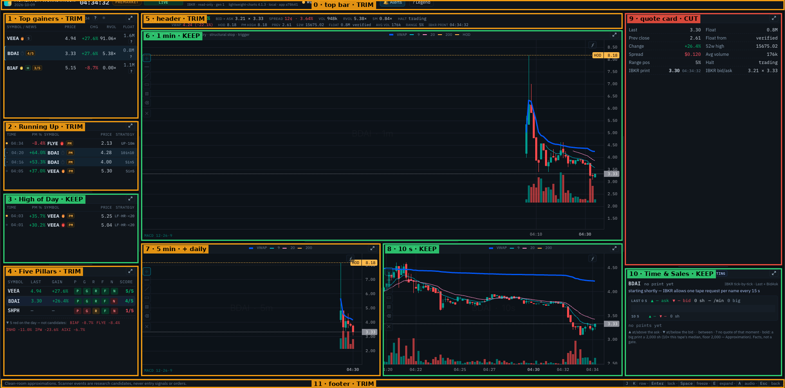
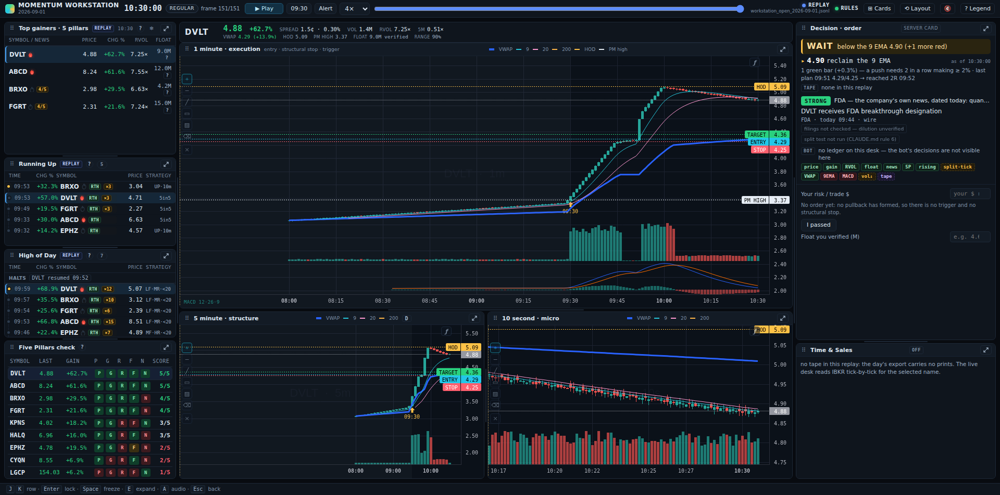
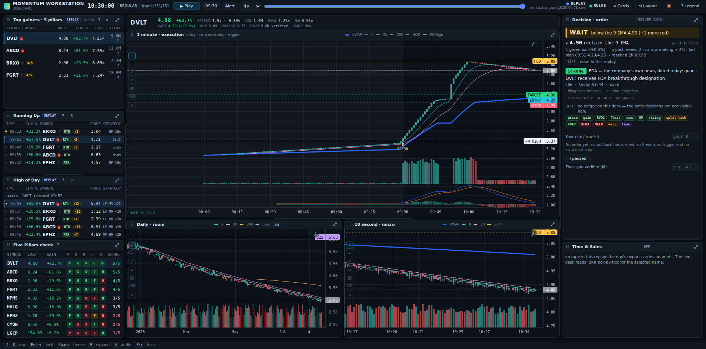
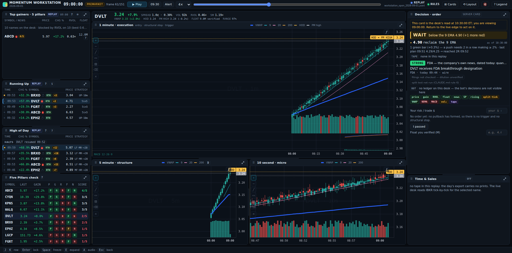

# The desk, grid by grid: what Ross uses, what is clutter

```
SOURCE   the owner's screenshot, 2026-10-09 04:34:32 ET — PREMARKET, feed LIVE, IBKR read-only
BUILD    page "app a78641" = branch head 3fb391c (python3 scripts/app_build.py → app a78641): current code
MODE     desk only: before 06:55 the day command runs the desk alone on the last session's board
         names (docs/day-runbook.md, "Any hour"); the bot starts at 06:55
METHOD   every element read in the code that draws it — src/momentum_platform/dashboard/web/index.html,
         src/momentum_platform/dashboard/web/app.js, src/momentum_platform/scanners/momentum_events.py,
         src/momentum_platform/datasources/ibkr_tape.py — and set against what Ross uses, read for this
         audit from knowledge-base/strategies/FILTERS.md, knowledge-base/strategies/SCANNERS.md,
         knowledge-base/daytrade-dash/PLAYBOOK.md, the Preview course notes
         (CLAUDE_ROSS_TRADING_MASTERY_2026-08-31/references/day-trading-basics-preview-mastery.md)
         and the corpus register counts (python3 scripts/corpus.py)
LABELS   Confirmed (course, platform, or his words with video id + time) · Observed · Approximation
         (ours) · Unknown
! No market claim is made here. Prices quoted are what the screenshot shows at 04:34:32 ET.
```



**12 zones · 44 elements judged: 23 keep · 17 trim, move or fix · 3 cut · 1 to add (the daily) — and 6 things
he uses that the desk does not show.**
Green = keep, amber = trim or change, red = cut.

---

## What Ross's screen is, in his words and the course's

| what | his practice | source |
|---|---|---|
| scanners, in the order he opens them | **Top Gainers → Small-Cap HOD Momentum → Running Up → Halt** | `w97KlUrVDk0` @00:48:44–00:49:03 (`knowledge-base/daytrade-dash/PLAYBOOK.md`) |
| the first scanner of the day | *"this top gainer scanner is the first scanner that I look at every morning… always sorted by leading gain"* | `w97KlUrVDk0` @00:49:16 |
| how much of the list | only the top 10 — *"they should be in the top 10 of this list"* | `w97KlUrVDk0` @00:53:37 (`SCANNERS.md`) |
| keep it simple | *"you could fill your whole screen with scanners… keep it simple, focus on the gap scanner out of the gates"* | `eCSzHYl8apo` @00:14:19 (`SCANNERS.md`) |
| the five pillars | up ≥ 10 % · RVOL 5× · news · $2–20 · float < 10M | `oKlhUSSHe2Q` @00:30:16–00:30:38 |
| how many pillars | 5/5 excellent, 4/5 acceptable, **3/5 should usually be passed** | Preview ch. 3 (Confirmed course) |
| the signal in the alert tiles | *"a stock hitting scanners more and more times is definitely a good indicator that it's got some momentum"*; one alert — *"probably not going to trade it"* | `yg5E_mqGFGg` @00:17:02, @00:16:47 |
| the minimum layout | **linked 1-minute, 5-minute and daily charts · Level 2 · Time & Sales** · order entry · positions · working orders · executions · scanners and news | Preview ch. 6 (Confirmed course) |
| the charts' jobs | 1-minute = execution; **10-second helps with micro pullbacks**; 5-minute and daily = context and room | Preview ch. 5 |
| the indicators | 9 and 20 EMA · 200 EMA · VWAP · MACD 12/26/9 **read mainly on the 1-minute** (10-second MACD flips too often, 5-minute lags and conflicts) · volume | Preview ch. 5 |
| where his eye is at the entry | *"So, where is my eye? It's mostly on the time and sales right here and on the ask price."* | `ZfwTJAMLroA` @01:08:06–01:08:12 |

Register split, where it matters: "level two" — 761 hits in 122 teaching files, **264 in 134 live streams**,
13 in the recaps; "time and sales" — 38 teaching, 15 in 8 streams; "daily chart" — 339 teaching, **212 in 111
streams**; "10 second chart" — 8 teaching, **65 in 44 streams**. Level 2, the tape, the daily chart and the
10-second chart are things he uses live, not only teaches.

---

## Zone by zone

`✗` marks the element that fails. Every verdict is a recommendation; nothing below has been changed yet.

### 0 · Top bar — TRIM

| element | what it is | decision it serves | verdict |
|---|---|---|---|
| date, clock 04:34:32 | ET wall clock | his session is clock-driven (07:00 start, 11:30 edge) | KEEP |
| PREMARKET badge | session phase | pre-market has no halts; the bot enters from 07:00 | KEEP |
| LIVE | feed state | trust before numbers | KEEP |
| ✗ "IBKR · read-only · gen 1" | connection count since start | none until a reconnect | MOVE to the LIVE dot's tooltip |
| ✗ "TRADINGVIEW · lightweight-charts 4.1.3 · local · app a78641" | chart library and page build | none: a stale build raises the red RESTART banner on its own | MOVE to a tooltip |
| ✗ RULES | shared rule-profile hash, for comparing two traders' desks | none for one owner | MOVE to a tooltip |
| Cards · Layout · Alerts · Legend | tools | Layout restores the desk (zone 9) | KEEP |

### 1 · Top gainers · 5 pillars — TRIM

**What it holds.** The server's five-pillar list plus **any name the desk holds that passes 3 of 5 pillars**,
all sorted by change on the day (`app.js`, the `five_pillars_list` tile). Per row: symbol, flame (headline
age), a catalyst letter (H hard · D dilutive · S soft), an `n/5` chip when under 5, price, change, RVOL,
float, and a `?` that opens "why this row is here". Header: LIVE, the list's age, ❄ freeze.

**What it serves.** Ross's first look of the day, sorted by leading gain — the right tile in the right place.

| element | verdict | why |
|---|---|---|
| price · change · RVOL · float | KEEP | four of the five pillars |
| flame | KEEP | he reads flame colour: red and orange = breaking news (`oxob0x0Xz7s` @00:58:06) |
| `n/5` chip, `?` drawer, ❄ freeze | KEEP | which pillar is short is one click away |
| ✗ **BIAF −8.7 %, 3/5, RVOL 0.00×** | CUT the row | a red name on a gainers list. It is admitted by the desk's 3-of-5 rule; the course passes 3/5, and the Five Pillars check already folds red names (owner, 2026-10-08). Show names **green on the day with 4/5 or 5/5** only |
| ✗ the **S** next to VEEA's flame | MOVE to the decision card | the "soft catalyst" letter reads as a **5** beside the `3/5` and `4/5` chips; the grade belongs on the card, where the headline is |

### 2 · Running Up — TRIM

**What it holds.** Alert rows: time, change from the previous close (headed "PM %" before 09:30, "Day %"
after), symbol, flame, session chip, price, strategy. `5in5` and `10in10` are the squeeze branches he names
(Confirmed, `SCANNERS.md` B1). `UP·10m` is this desk's own rule — +3 % over ten minutes at the window high,
above the ten-minute VWAP (`momentum_events.py`, `UptrendScanner`; Approximation).

**What it serves.** His third scanner, for the news hours: *"the running up scanner tells me when a stock is
squeezing up right now even if it's below its high of day. In fact, it has to be below the high of day."*
(`w97KlUrVDk0` @01:00:52). This desk's tile is wider by your decision of 2026-09-23 (names at their high of day
too), so it overlaps the HOD tile on purpose.

| element | verdict | why |
|---|---|---|
| time · price · strategy · flame | KEEP | the event and its kind |
| session chip "PM" | KEEP | after 09:30 it tells a pre-market alert from a regular-hours one |
| ✗ **FLYE −8.4 % UP·10m** | DIM or hide | a +3 % bounce on a name red on the day: pillar 1 (up ≥ 10 %) fails. The +3 % threshold is ours |
| ✗ **BDAI twice** (04:16 `5in5`, 04:20 `10in10`) | MERGE into one row, "BDAI ×2" | the repeat is his signal (`yg5E_mqGFGg` @00:17:02) — count it instead of listing it. Both fired at 4.00 and 4.28, after the 8.18 spike: bounces on a fade, which the alert tile cannot know (zone 9) |
| ✗ "PM %" here, "CHG" in zone 1 | RENAME to one word | one number, one name |

### 3 · High of Day — KEEP

New-high alerts with their branch: `LF·HR·<20` = low float, high relative volume, under $20 — the branch he
names (`yg5E_mqGFGg` @00:15:30) on his second scanner. His primary tile from 09:30 (`PLAYBOOK.md`). Same
"PM %" rename as zone 2; the branch codes are already in the Legend.

### 4 · Five Pillars check — TRIM

**What it holds.** Every name the desk holds: last, gain, five lamps (P price · G gain · R RVOL · F float ·
N news) and the score; names red on the day fold into one line.

**What it serves.** The one place that says **which** pillar fails — BDAI's red N (no headline). His own
5-Pillars list is a state, not a log: a name drops off when it stops qualifying (`oKlhUSSHe2Q` @00:31:00);
his platform does not check news at all, the N lamp is this desk's own read (`PLAYBOOK.md`, vendor).

| element | verdict | why |
|---|---|---|
| lamps · score · red fold | KEEP | the reason, per pillar |
| ✗ **SHPH — — 1/5** | FOLD | no print yet this session: nothing to judge. Fold it like the red names ("no print yet: SHPH") |

The five red names in the fold (BIAF, FLYE, INHD, IPW, AIXI) are yesterday's: a desk alone before 06:55
opens on the last session's board. Expected.

### 5 · The symbol header — TRIM

Line 1 is what moves, line 2 the levels and the supply (`app.js`, `renderHeader`).

| field (on the screen) | his use | verdict |
|---|---|---|
| BDAI 3.30 +26.4 % | pillar 1 | KEEP |
| bid × ask 3.21 × 3.33 · spread 12¢ · 3.64 % | the course requires a tolerable spread; the platform never checks it for you (`PLAYBOOK.md`); the bot sizes its stop at ≥ 4× the spread (A6) | KEEP — 3.64 % is shown red, rightly |
| vol 948k | ≥ 1M session volume is where he makes money; **pre-market over ~1M = "I'm not the first one to see it"** (`FILTERS.md`) | KEEP |
| rvol 5.38× · 5m 0.84× | pillar 2; 5-minute RVOL *"helpful for seeing volume spiking up right now"* (`yg5E_mqGFGg` @00:08:38) | KEEP |
| ✗ halt "trading" | no halts pre-market or after hours (`5aWoZdbXJrA` @00:47:03) | SHOW ONLY when halted |
| vwap 4.24 (−22.1 %) | chart gate: price above VWAP | KEEP |
| hod 8.18 · pm high 8.18 | first target · gate 4 anchor | KEEP, and ADD the distance: **gate 4 kills a name more than 25 % off its pre-market high** (`FILTERS.md`). On this screen BDAI is 3.30 against 8.18 — 59.7 % off |
| ✗ prev 2.61 | the denominator of the change | MOVE to the change's tooltip |
| ✗ 52w 15675.02 | as a number, noise: 4,750× the price. `FILTERS.md` uses it as a **flag** — a 52-week high over 20× the price means split-adjusted history (reverse splits, dilution context) | REPLACE with "split history" when over 20×, else hide (the daily chart shows room) |
| float 0.8M verified | pillar 5, with its source | KEEP |
| ✗ avg vol 176k | the RVOL denominator | MOVE to the RVOL tooltip |
| range 5 % | "Position in Range" is a column of his own 5-Pillars list (Confirmed visible, `dashboard-scanner-chart-knowledge.md` §10 row 3); 5 % = at the low, back side | KEEP |
| ✗ ibkr print 04:34:32 | freshness of the last print | SHOW ONLY as an age when the print is older than ~10 s |

### 6 · 1 minute · execution — KEEP

Candles, volume, VWAP, EMA 9/20/200, the HOD line, the MACD 12/26/9 pane, the plan bands (entry · structural
stop · trigger), the drawing bar. His execution chart with his indicator set (Preview ch. 5). The 200 is used
live intraday — *"Support is at the 200 moving average, which is 3314. So, 50 cents of risk"*
(`FdAKQS9GJFE` @01:26:50).

- ADD the **pre-market high line** — the gate-4 anchor and his anticipation level (`FILTERS.md` Layer 2:
  position 10–25¢ under a whole dollar or the pre-market high). At 04:34 it coincides with the HOD.
- The MACD pane is empty at 04:34 because it draws from 35 one-minute bars (`app.js`, `macdLines`). Not a fault.

### 7 · 5 minute · structure — CHANGE: add the daily

The context chart, with the same indicators.

- ✗ **No daily chart on screen.** His minimum layout links the 1-minute, the 5-minute **and the daily**
  (Preview ch. 6), and the strong-daily-chart checklist — room to the next resistance, the daily 200 — is how
  he judges a name before the trade (Preview ch. 5). The desk has a "Daily · room" card, in the tray. Give this
  pane a one-key toggle 5-minute ⇄ daily, which is what the clean-room spec recommends for the context chart
  (`dashboard-scanner-chart-knowledge.md` §14).
- ✗ MACD here — the course reads MACD on the 1-minute; the 5-minute one *"can lag and conflict"*. REMOVE.

### 8 · 10 second · micro — KEEP

*"this is a 10 second micro pullback so let it pull back and then we'll get that curl up through 20"*
(`6xIr761eZj8` @00:41:38); "10 second" appears 250 times in 117 streams and in 15 of 68 recaps of June–July 2026
(`PARAMETERS.md`). No MACD on it — right, by the course. In thin pre-market tape it is mostly noise; from 07:00 it
is the entry's microscope.

### 9 · Quote · supply · risk — CUT (and the decision card back)

Every field on this card repeats the header: last, previous close, change, spread, range position, IBKR
print, float and its source, 52-week high, average volume, halt, bid × ask.

**It is not in the default layout.** A click on a card in the **Cards** tray, when no card was clicked
before, puts it in R1 (`app.js`, the tray item's click: `layout.R1`) — **the decision card's slot**. The
layout is saved in the browser, so it stayed. **⟲ Layout** brings the decision card back.

What the screen loses without it: the verdict word (REVIEW / WATCH / WAIT / NO) with the one reason and the
level that changes it, every gate as a lamp, the catalyst in two lines, the bot's answer, the order panel and
your took / passed buttons. On this screen BDAI wears a `4/5` chip and two Running Up alerts, and **nothing
on it says the name is 59.7 % under its pre-market high** — the one fact that kills it (gate 4).

FIX: a tray click never takes the decision card's place.

### 10 · Time & Sales — KEEP, trim the text

IBKR tick-by-tick for the selected name; each print's side read against the quote that stood; a 60-second and
a 10-second facts line (share at the ask, at the bid, shares, prints a minute, big prints — Approximation, facts
not gates). His eye at the entry is here and on the ask (`ZfwTJAMLroA` @01:08:06–01:08:12), read together with
Level 2: *"The difference between level two and time and sales is that level two, um, shows you the buy and
sell orders… time and sales… shows you where people are buying and where they're selling"*
(`ZfwTJAMLroA` @01:44:36–01:44:51).

| element | verdict |
|---|---|
| prints, tag (LIVE / QUIET / STARTING / ERROR), the 60-s facts line | KEEP |
| ✗ the three legend lines (▲ ask · ▼ bid · ? · big print ≥ 2,000 sh…) | MOVE to the Legend overlay |
| ✗ zeroed facts when nothing printed ("LAST 0 S ▲ — ask ▼ — bid 0 sh…") | REPLACE with one line, "no prints yet" |
| ✗ the 10-s line | SHOW ONLY when it differs from the 60-s line |

On the screen it reads *"starting shortly — IBKR allows one tape request per name every 15 s"*: BDAI was
selected again within 15 seconds (`ibkr_tape.py`, `_schedule`). It starts by itself. If it still says so a
minute later while the header's print time moves, that is a defect.

### 11 · Footer — TRIM

The key hints (J K row · Enter lock · Space freeze · E expand · A audio · Esc back): KEEP. ✗ The disclaimer is
already in the Legend overlay: MOVE it there only.

---

## What he uses that the desk does not show

| # | what | source | on the desk today | proposal |
|---|---|---|---|---|
| 1 | **daily chart** | Preview ch. 5–6; 212 hits in 111 streams | in the tray | toggle on zone 7 |
| 2 | **Level 2** | Preview ch. 6; *"I'm gonna be watching the level 2 very closely watching the tape i want to see whether or not we have bids"* (`cZUOv7-oA8o` @00:51:05–00:51:09); *"when I see a hidden buyer on the level 2 I certainly like that"* (`q2cXzSLqyk8` @00:29:46–00:29:48); `FILTERS.md` Layer 2 `no_seller_wall` | none real. ✗ The tray's "Level 2 · simulated" card shows invented depth | delete the simulated card. A real book needs market-depth data on your IBKR account: which subscription and its cost were not checked here — your call |
| 3 | **halt list** | his fourth window (`w97KlUrVDk0` @00:48:44–00:49:03); halts exist 09:30–16:00 only | the header and the alert timeline | a halts line in zone 3 from 09:30 |
| 4 | **alert count per name** | `yg5E_mqGFGg` @00:17:02 | rows repeat, nothing counts them | "×N" on the row (zone 2) |
| 5 | **pre-market high line** | `FILTERS.md` gate 4 and Layer 2 | a number in the header | a line on zone 6, and the distance in the header |
| 6 | **order entry, positions, working orders** | Preview ch. 6 | by design none: paper, IBKR read-only, no order path | your broker window places the order; the decision card gives the numbers and logs your call |

Whole- and half-dollar lines (*"after HOD, watch half-dollar and whole-dollar levels"*, Preview ch. 5) are optional.

---

## What this audit could not check

- **One screenshot, one minute** — 04:34 ET, pre-market, the desk alone. The decision card was not on the screen,
  so what it said about BDAI at that minute is not judged here.
- The **S** read as a 5 is from the code (the grade letters in `app.js`), not from a zoom of the pixels.
- **Tick-by-tick in the pre-market on your account**: not verified live.
- **Level 2 data on your IBKR account**: which subscription, and what it costs, not checked.
- **No measurement says any field above improves a result.** This audits fidelity to his stated toolset and
  clutter; it is not evidence of an edge. The 894-session replication was negative expectancy
  (`research/momentum-replication/reports/2026-08-regime-filter.md`). Paper only.

---

## Verdict

**Keep** his three scanners and the pillar check, the 1-minute and 10-second charts, the Time & Sales and the
header's first line: this is his screen.

**Cut** the quote card — it is the decision card's slot, filled by a tray click — and the noise: previous
close, average volume, the raw 52-week number, "halt trading" before the open, the engineering strings in the
top bar, the footer disclaimer, the simulated Level 2.

**Fix** the tray click that replaced the decision card, red and 3-of-5 names on the gainers list, red names
in Running Up, rows with no print.

**Add** the daily chart (a toggle on the 5-minute pane), the pre-market-high distance and line (gate 4), the
alert count — and Level 2 if you take the data.

The first thing to do needs no code: **press ⟲ Layout** to bring the decision card back.

---

## Applied the same day — the owner chose all four

| choice | what changed | where |
|---|---|---|
| decision card + declutter | a tray click never replaces the decision card (click the card to replace first, or drag); layout key v11, so every saved desk comes back to it; header: previous close to the change's tooltip, average volume to RVOL's, "halt" only when HALTED, 52-week high only as "×N split history" over 20×, the print time only when old, the pre-market high with its distance (red past 25 %); top bar: the chart library line shows only on a fallback, "gen N" only after a rebuild; footer and tape legend into the Legend; zeroed tape facts replaced by "no prints yet"; the simulated Level 2 deleted | `src/momentum_platform/dashboard/web/app.js`, `index.html`, `styles.css` |
| scanner tiles | gainers list: green names with 4 or 5 pillars; no catalyst letter on rows; "Chg %" on all three tiles; alert tiles one row per name with ×N, names not up 10 % dimmed; the pillar check folds names with no print | same |
| Ross's missing views | **D** (or the button on the pane) switches the 5-minute pane to the daily; the pre-market high line on the 1-minute ("HOD = PM HIGH" when equal); MACD on the 1-minute only (indicator key v2); a halts line in the High of Day tile from 09:30 | same |
| real Level 2 | researched, not built — owner: not yet: $22.00/month on the live user shared to paper ($17.50 if Networks A, B, C are held) — TotalView-OpenView $16.50 + EDS $1.00, which the API needs; pre-market depth and depth on the paper login unconfirmed | `docs/day-runbook.md`, "Level 2" |

After, on the replay of 2026-09-01 (the desk's own charts, real-time renderer):







Replay caveat: scrubbing a replay backwards keeps the alerts already seen, so
the 09:00 shot shows 09:5x alerts and a halt from later — the live desk only
ever moves forward.
